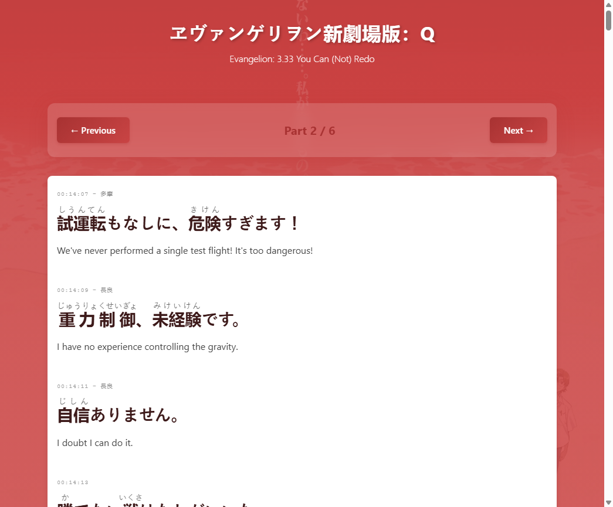

# eva-script-japanese

Learn Japanese through the Evangelion Rebuild movie transcripts.



## What It Is

This project turns Evangelion subtitle tracks into a small static study site:

- Japanese lines with ruby/furigana
- English translation
- client-side pagination with lazy-loaded JSON
- one home page for all 4 movies

The active source set uses the JP and EN TTML2 subtitle files for:

- `Eva1` / `1.11`
- `Eva2` / `2.22`
- `Eva3` / `3.33`
- `Eva4` / `3.0+1.01`

Chinese files are intentionally ignored for now.

## Project Layout

- `web/`: the React/Vite app
- `prepare/`: reusable data preparation and validation scripts plus local source files
- `archive/legacy-2025/`: old one-off pipeline and legacy outputs
- `docs/`: active documentation

Inside `prepare/`:

- `scripts/`: dataset build and validation scripts
- `sources/ttml/`: local JP/EN source subtitle files used by the pipeline
- `workspace/intermediate/`: generated aligned data for inspection
- `workspace/reports/`: generated summary reports

## Data Pipeline

The current preparation flow is documented in [data-pipeline.md](/C:/Users/User/Desktop/260204%20TeamAI2/team-ai-3/members/Maya%20Programmer/eva-script-japanese/docs/data-pipeline.md).

From `prepare/`:

```bash
npm install
npm run prepare:data
npm run validate:data
```

The pipeline:

1. Parses JP and EN TTML2 files.
2. Preserves source ruby when present.
3. Generates furigana for remaining Japanese text.
4. Aligns EN lines against JP timing.
5. Splits each movie into 5-6 JSON files.
6. Writes final app data into `web/src/data/`.

## Frontend

From `web/`:

```bash
npm install
npm run dev
```

Movie selection now uses query parameters like `?movie=eva-3.33&part=1`, which works in a static deployment without hash fragments.

## Notes

- This is a fan-made educational project.
- Subtitle alignment and furigana quality still need manual review.
- Review helpers and generated reports are kept on purpose instead of being discarded.
